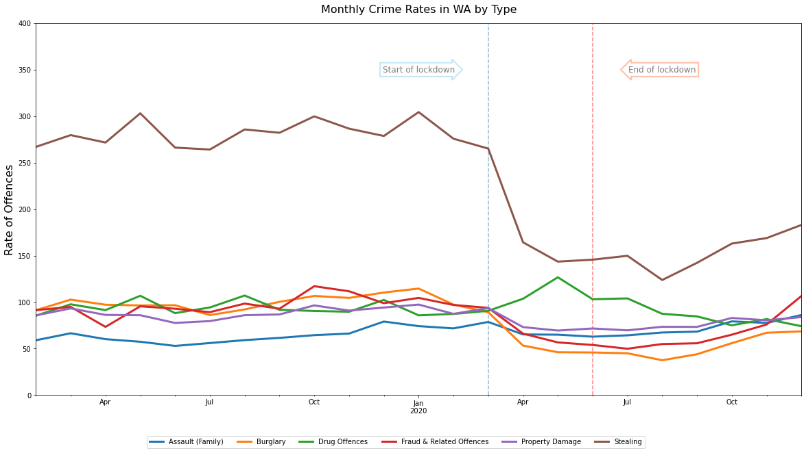
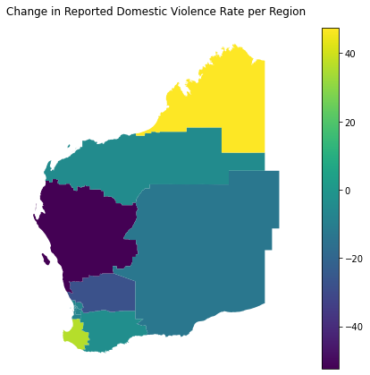
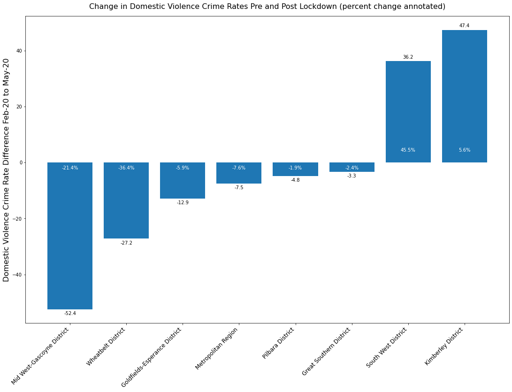
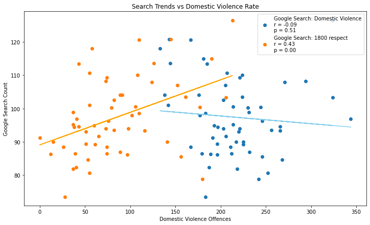

# Impact of Covid-19 on WA Crimes 


# Project Introduction 
The aim of this project was to infer what impacts coronavirus restrictions had on domestic violence in WA through examining WA crime rate statistics. 
We chose this topic as we were interested to see if the national and international observations of increased domestic violence were mirrored in WA.
Crime rate stastics were used as there were no recent, specific domestic violence stastics readily available to us.
We examined both the overall crime rates and took a deeper dive into domestic voilence related crimes.

Our hypothesis was:
> During the coronavirus lockdown period in WA, March to June 2020, there would be an observable increase in domestic violence crime rates


# Structure 
```
|_datasource                                      # data resources 
    |_1800respect.csv
    |_ERP.xls
    |_Pooled data, time series (Tables 28a to 33b).xls
    |_Time series (Tables 4a to 8d).xls
    |_Violence prevalence and time series (Tables 1 to 5).xlsx
    |_WA Police Force Crime Timeseries.xlsx
    |_domestic violence google trend.csv
    |_dv help google trend.csv
    |_googlesearchdvastopic.csv
    |_wa dv help google trend.csv
    |_wadvsearch.csv
    |_Police_Districts.shp
    |_Police_Districts.shp.xml
    |_Police_Districts.shx

|_output                                           # saved cvs and png files 
    |_Crime.png
    |_Regionsdvinto.csv
    |_Regionsdvout.csv
    |_Regionsinto.csv
    |_Regionsout.csv
    |_WAkeycrimeheatmap.png
    |_WAkeycrimetrends.png
    |_crimemap.png
    |_crimerates.png
    |_crimeratesregions.png
    |_crimesoverperiodbar.png
    |_crimespercentchange.png
    |_crimetyperatesregions.png
    |_decreasingcrimes.png
    |_decreasingwacrimes.png
    |_dvmap.png
    |_dvratesregions.png
    |_gercrimerates.png
    |_googlesearchtrends.png
    |_headlines.csv
    |_increasingcrimes.png
    |_searchregressions.png
    |_standardisedcrimes.png
    |_timeframes.csv
    |_wbrcrimerates.png

|_gitignore                                       # gitignore for ignoring some files 
|_Presentation1.pptx
|_Project Proposal - Group 3
|_README.md
|_Maps.ipynb
|_WA Crime Rates.ipynb

```


# Usage
```
# create environment 
conda env create --file projectenv.yml


# activate environment
conda activate projectenv
```


Or set up environment with out projectenv.yml install:
* python 3.8.5
* pandas 1.2.4
* numpy 1.20.1
* matplotlib 3.3.4
* geopandas 0.6.1
* json 0.9.5
* requests 2.25.1
* datetime 
* scipy 1.6.2


# Questions 
1. What impact did coronavirus restrictions have on crime rate in WA?
2. What impact did coronavirus restrictions have on domestic violence crime rate in WA?
3. What other indicators can be used to estimate the level of domestic violence crime?


# Datasets
|No.|Source|Link|
| -|-|-|
|1|Western Australia Police Force Crime Statistics|https://www.police.wa.gov.au/Crime/CrimeStatistics#/|
|2|Estimated Resident Population for WA |https://profile.id.com.au/wapl/population-estimate?BMID=40|
|3|Google Trends|https://trends.google.com/trends/?geo=AU|
|4|The Guardian API|https://open-platform.theguardian.com/|
|5|WAPOL District Boundaries|https://catalogue.data.wa.gov.au/dataset/wa-police-district-boundaries|
|6|ABS Personal Safety Report|https://www.abs.gov.au/statistics/people/crime-and-justice/personal-safety-australia/latest-release|

# Exploration
Exploration and analysis were generally conducted together as our understanding of the dataset developed. Key items to note from the data preparations were:
* Rates were calculated as offences per 100,000 people using the internationally recognised standard below:
> Offence rate per 100,000 = (Offence count ÷ Estimated Resident Population) × 100,000

* The Estimated Resident Population was derived from the WA Parlimentary Library(2)

* Domestic Violence crime was an aggregation of Assault(Family), Threatening Behaviour (Family) and Breach of Family Violence Restraint Order. Crimes in other catagories such as Sexual Assault may have also been domestic violence related but this was unable to be determined from the given statistics.

* Google trends were obtained for all of Australia due to the limited WA data

*1800respect was chosed as a search term as it is the national and most prominent domestic violence helpline and there was limited time to reserch other helplines

* An API key is required to access the Gaurdian API however it is free to register 

# Analysis 
## __What impact did coronavirus restrictions have on crime rate in WA?__

The general trends showed that most regions experienced a descrease in total crime rates:


<br/>

<br/>


Closer examination of the difference in crime rate before lockdown (February 2020) and into lockdown (May 2020) showed that crime rates dropped by 4.6 to 34% in all regions except Wheatbelt which experienced an increase of 14%:


The bar graph below depicts crime rates pre, during and post lockdown, February, May and June respectively. It could be seen that only the most frequently commited crimes were worth considering in analysis:


The crimes with the top 6 offence counts for the previous year, 2019, were selected as key crimes for examination. The trends of WA crime rates below showed that all of these crimes decreased over lockdown except for drug related offences.



 


## __What impact did coronavirus restrictions have on domestic violence crime rate in WA?__

The above observations did not support our hypothesis, there was no observable increase in domestic violence crime rates. We conducted an article search using The Gaurdian API for articles from March 2020 onwards containing "lockdown" and "domestic violence". Almost 1000 articles were retrieved and examination of the headlines confirmed that there were increases observed nationally and internationally.


We then took a closer look at domestic violence crimes across each region, domestic violence related crimes were aggregated and the general trends showed that although most regions had a slight reduction in crime rates the Kimberley Region experiences the highest rates in the state and there was a significant increase which appears to have continued past the lockdown periods:


This could mean that the impact of the lockdown on domestic violence was not immediate and has been pervasive after lockdown was lifted or that greater visibility of domestic violence over lockdown lead to more reporting.

The difference in domestic violence crime rates before lockdown (February 2020) and into lockdown (May 2020) were mapped for each region using the WAPOL mapping dataset:





Both the above map and examination of the differences in the bar chart below showed that South West Region also experienced an increase in domestic violence. All other regions experienced a decrease:





## __What other indicators can be used to estimate the level of domestic violence crime?__
The above information partially supported our hypothesis as some regions experienced an increase in domestic violence crime however we began to believe that crime rates were not an accurate indicator for domestic violence as reasearch into reporting rates showed that only 54% of women and 29% of men experiencing domestic violence will seek help(6). Increased social isolation, and decreased ability to move, may have further restricted victims ability to safely report domestic violence crimes and seek help.

We thought to look at what other indicators we could use to measure domestic violence such as calls to helplines and use of other resources. Due to the limited recent public information on those statistics the best available resource to us was google search trends. We compared trends for searchs in Australia on "Domestic Violence" and "1800respect" with the WA domestic violence crime rates. An increase analogous to crime rates was observed over the lockdown period:


Although there appeared to be an increase in both search trends over the lockdown period, this did not immediately mean they were related to actual domestic violence. Both monthly search statistics were plotted against monthly domestic violence crime rates between 2016 and 2020 and correlations performed. 





There was no correlation between google searches for domestic violence as a topic and crime rates. However, there is a moderate positive correlation between searches for 1800respect as a keyword and crime. This relationship could indicate that it is a useful indicator of domestic violence, further investigation into other helpline search trends or the ability to obtain the actual helpline statistics would allow us to expand on this relationship.


# Contributors 
:small_blue_diamond: Fern Bradder: (https://github.com/FernB)  
:small_blue_diamond: Sri Vegunta: (https://github.com/SriVegunta)  
:small_blue_diamond: Petra Moyle: (https://github.com/PetraMoyle)  
